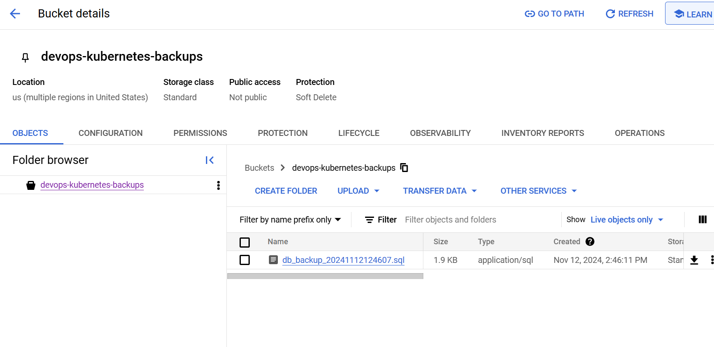

The github actions workflow is showcased in this repo
https://github.com/JuhoSiitonen/DWK-project

This repo was used for exercises for all the github actions related exercises for convenience.

This exercise 3.07 with the backup creation, required me to change some settings in the VMs running in Google cloud. Because after several tests the VMs were still using only a default service account provided by the compute engine. But now the cronjob pg_dump works!

